```mermaid
flowchart TD
    START([Resume work on Enel]) --> Q_DIRECTION

    %% ───────────────────────────────────────────────
    %% GATE 0 — PRODUCT DIRECTION
    %% ───────────────────────────────────────────────
    Q_DIRECTION{{"What is the product?"}}
    Q_DIRECTION -->|Personal tool / open-source| DIR_PERSONAL
    Q_DIRECTION -->|SaaS — other users pay for it| DIR_SAAS
    Q_DIRECTION -->|Undecided| DIR_UNDECIDED

    DIR_PERSONAL["Path: Personal / OSS\n• Stay on whatsapp-web.js\n• Self-hosted, one user per instance\n• Legal risk accepted by the individual"]
    DIR_SAAS["Path: SaaS\n• Requires WhatsApp Business API\n• Full multi-tenancy + auth + billing\n• 10× scope vs current codebase\n⚠️  Do not start until personal version is validated"]
    DIR_UNDECIDED["Path: Undecided\n• Build personal-first\n• Add nullable userId columns now\n• Keep the SaaS door open cheaply"]

    DIR_PERSONAL --> PHASE0
    DIR_SAAS --> SAAS_GATE
    DIR_UNDECIDED --> PHASE0

    %% ───────────────────────────────────────────────
    %% SAAS GATE — prerequisite check
    %% ───────────────────────────────────────────────
    SAAS_GATE{{"Do you have paying users\nor validated demand?"}}
    SAAS_GATE -->|No| SAAS_WAIT
    SAAS_GATE -->|Yes| SAAS_PATH

    SAAS_WAIT["⏸ Stop.\nBuild the personal version first.\nValidate that people want it.\nCome back to SaaS later."]
    SAAS_WAIT --> PHASE0

    SAAS_PATH["SaaS prerequisite work\n1. Evaluate WhatsApp Business API BSPs\n   (Twilio, 360dialog, Meta Cloud API)\n2. Design multi-tenant schema\n3. Choose auth provider (Auth0, Clerk, JWT)\n4. Plan billing (Stripe)\n5. Estimate WhatsApp API cost per user"]
    SAAS_PATH --> PHASE0

    %% ───────────────────────────────────────────────
    %% PHASE 0 — FOUNDATION
    %% ───────────────────────────────────────────────
    PHASE0[["Phase 0 — Stabilize the Foundation\n(do this before anything else)"]]
    PHASE0 --> FIX_AUDIT
    PHASE0 --> FIX_CONFIG
    PHASE0 --> FIX_DOCKER
    PHASE0 --> FIX_SHUTDOWN

    FIX_AUDIT["npm audit fix\nPatches: ReDoS in minimatch,\nqs ArrayLimit, lodash prototype pollution"]
    FIX_CONFIG["Set generateReplies: true\nas the default config\n(core feature is currently disabled)"]
    FIX_DOCKER["Write docker-compose.yml\nNode app + PostgreSQL + ChromaDB\nSo anyone can run this"]
    FIX_SHUTDOWN["Add graceful shutdown\nDrain DB pool on SIGTERM/SIGINT"]

    FIX_AUDIT --> Q_VECTOR
    FIX_CONFIG --> Q_VECTOR
    FIX_DOCKER --> Q_VECTOR
    FIX_SHUTDOWN --> Q_VECTOR

    %% ───────────────────────────────────────────────
    %% VECTOR DECISION
    %% ───────────────────────────────────────────────
    Q_VECTOR{{"Vector DB decision\n(current state is broken)"}}
    Q_VECTOR -->|Want real semantic search| VEC_REAL
    Q_VECTOR -->|Want simplicity, single DB| VEC_PGVECTOR
    Q_VECTOR -->|Semantic search not needed yet| VEC_DROP

    VEC_REAL["Option A — Real Embeddings\nReplace embeddingService.js with:\n• Ollama /api/embeddings (free, local)\n• OpenAI text-embedding-3-small (cheap)\nKeep ChromaDB as the vector store"]
    VEC_PGVECTOR["Option B — pgvector (recommended)\nInstall pgvector PostgreSQL extension\nDrop ChromaDB entirely\nStore vectors in Messages table\nOne fewer external service to run"]
    VEC_DROP["Option C — Remove Vector Search\nDelete: vectorDb.js, vectorSearch.js\n  embeddingService.js, vectorJob.js\nUse recency-only history for context\nHonest: current hashes add no value anyway"]

    VEC_REAL --> PHASE2
    VEC_PGVECTOR --> PHASE2
    VEC_DROP --> PHASE2

    %% ───────────────────────────────────────────────
    %% PHASE 2 — TESTS (safety net before refactoring)
    %% ───────────────────────────────────────────────
    PHASE2[["Phase 2 — Write Integration Tests\n⚠️  Do this BEFORE refactoring the interface layer"]]
    PHASE2 --> TEST_INGEST
    PHASE2 --> TEST_DRAFT
    PHASE2 --> TEST_SEND
    PHASE2 --> TEST_API

    TEST_INGEST["message-ingestion.test.js\nMessage arrives → stored in DB correctly"]
    TEST_DRAFT["draft-generation.test.js\nLLM called with correct history + context"]
    TEST_SEND["send-flow.test.js\nDraft approved → Outbox → sent"]
    TEST_API["dashboard-api.test.js\nGET /drafts, POST /send/:id, GET /outbox"]

    TEST_INGEST --> PHASE3
    TEST_DRAFT --> PHASE3
    TEST_SEND --> PHASE3
    TEST_API --> PHASE3

    %% ───────────────────────────────────────────────
    %% PHASE 3 — COLLAPSE DUAL INTERFACE
    %% ───────────────────────────────────────────────
    PHASE3[["Phase 3 — Collapse Dual Approval Interface"]]
    PHASE3 --> INTERFACE_DECISION

    INTERFACE_DECISION{{"Which interface wins?"}}
    INTERFACE_DECISION -->|Dashboard — correct choice| INTERFACE_WEB
    INTERFACE_DECISION -->|CLI only| INTERFACE_CLI

    INTERFACE_WEB["Dashboard-first path\n• Remove CLI from message processing path\n• All messages → Outbox → dashboard\n• Add draft editing in dashboard\n• Add pagination to /drafts and /outbox\n• Keep CLI for setup/admin only"]
    INTERFACE_CLI["CLI-only path\n• Valid for purely personal local use\n• Drop dashboard complexity\n• Not compatible with remote deployment\n• Not compatible with multi-user future"]

    INTERFACE_WEB --> PHASE4
    INTERFACE_CLI --> PHASE4

    %% ───────────────────────────────────────────────
    %% PHASE 4 — JOB SCHEDULER
    %% ───────────────────────────────────────────────
    PHASE4[["Phase 4 — Add Job Scheduler\n(jobs currently have no execution trigger)"]]
    PHASE4 --> SCHED_DECISION

    SCHED_DECISION{{"Scheduler choice"}}
    SCHED_DECISION -->|Robust, PostgreSQL-native| SCHED_PGBOSS
    SCHED_DECISION -->|Simple, in-process| SCHED_CRON

    SCHED_PGBOSS["pg-boss or graphile-worker\n• PostgreSQL as job queue backend\n• Built-in retry, visibility, concurrency\n• Replaces JobStatus table + masterJob.js\n• No new infrastructure"]
    SCHED_CRON["node-cron\n• Simple setInterval-style scheduling\n• No extra DB tables\n• Less visibility and control\n• Fine for personal use"]

    SCHED_PGBOSS --> PHASE5
    SCHED_CRON --> PHASE5

    %% ───────────────────────────────────────────────
    %% PHASE 5 — TYPE SAFETY
    %% ───────────────────────────────────────────────
    PHASE5[["Phase 5 — Type Safety"]]
    PHASE5 --> TYPES_DECISION

    TYPES_DECISION{{"TypeScript or JSDoc?"}}
    TYPES_DECISION -->|Full TypeScript migration| TYPES_TS
    TYPES_DECISION -->|JSDoc annotations only| TYPES_JSDOC

    TYPES_TS["TypeScript\n• Full type checking at compile time\n• Higher upfront investment\n• Justified if going SaaS or team grows"]
    TYPES_JSDOC["JSDoc annotations\n• @param / @returns on all functions\n• IntelliSense in VS Code without compilation\n• Lower investment, most of the dev-UX benefit\n• Recommended starting point"]

    TYPES_TS --> PHASE6
    TYPES_JSDOC --> PHASE6

    %% ───────────────────────────────────────────────
    %% PHASE 6 — DIRECTION REVISIT
    %% ───────────────────────────────────────────────
    PHASE6[["Phase 6 — Revisit Product Direction"]]
    PHASE6 --> Q_REVISIT

    Q_REVISIT{{"Is the direction clear now?"}}
    Q_REVISIT -->|Personal / OSS confirmed| SHIP_OSS
    Q_REVISIT -->|SaaS confirmed, demand validated| SHIP_SAAS
    Q_REVISIT -->|Still undecided| SHIP_WAIT

    SHIP_OSS["Ship as open-source\n• Write a proper README / setup guide\n• Make onboarding frictionless\n• Consider GitHub release / Product Hunt"]
    SHIP_SAAS["Begin SaaS infrastructure\n• WhatsApp Business API integration\n• Multi-tenant schema (add userId everywhere)\n• Auth, billing, onboarding\n• Proper deployment pipeline (K8s, Railway, etc.)"]
    SHIP_WAIT["Keep building personal version.\nValidate with real users.\nCome back to this decision in 3 months."]

    SHIP_OSS --> DONE
    SHIP_SAAS --> DONE
    SHIP_WAIT --> DONE

    DONE([Done for now])

    %% ───────────────────────────────────────────────
    %% STYLING
    %% ───────────────────────────────────────────────
    classDef critical fill:#fee2e2,stroke:#dc2626,color:#7f1d1d
    classDef recommended fill:#dcfce7,stroke:#16a34a,color:#14532d
    classDef neutral fill:#f1f5f9,stroke:#64748b,color:#1e293b
    classDef decision fill:#fef9c3,stroke:#ca8a04,color:#713f12
    classDef phase fill:#dbeafe,stroke:#2563eb,color:#1e3a8a

    class VEC_DROP,INTERFACE_CLI,SCHED_CRON neutral
    class VEC_PGVECTOR,INTERFACE_WEB,SCHED_PGBOSS,TYPES_JSDOC recommended
    class SAAS_WAIT critical
    class FIX_AUDIT,FIX_CONFIG critical
    class PHASE0,PHASE2,PHASE3,PHASE4,PHASE5,PHASE6 phase
```

# Enel — Decision Flowchart

This diagram maps the decisions you face before and during resuming work on Enel. It is based on the findings in [`assessment.md`](./assessment.md).

---

---

## Reading This Diagram

- **Red** — Critical issues that must be addressed first, or dangerous paths to avoid.
- **Green** — Recommended choices at each decision point.
- **Blue** — Phases of work (ordered top to bottom).
- **Yellow** — Decision points where you choose direction.
- **Gray** — Valid but non-recommended alternatives.

## The Non-Negotiables

Regardless of every other decision, these must happen in Phase 0:

1. `npm audit fix` — there are high-severity CVEs in the current dependency tree
2. Set `generateReplies: true` as default — the core feature is disabled out of the box
3. Fix or decide on the vector DB — the current implementation is actively misleading

See [`assessment.md`](./assessment.md) for the full written analysis behind each node in this diagram.
